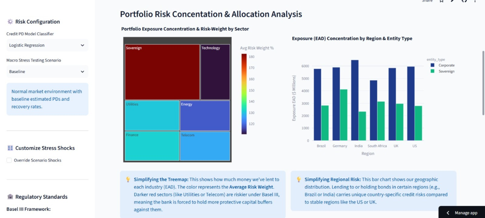
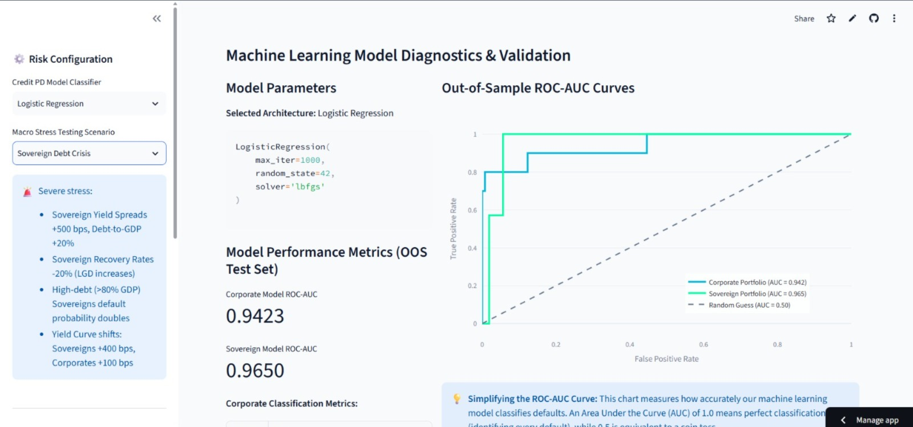

# Basel III Credit & Treasury Risk Engine

**Live Deployment URL:** [basel-credit-risk-engine.streamlit.app](https://basel-credit-risk-engine.streamlit.app/)

A production-grade Chief Investment Office (CIO), Treasury & Corporate (CTC) Risk quantitative engine that models Basel III credit risk, capital requirements, High-Quality Liquid Assets (HQLA) liquidity risk, and Interest Rate Risk in the Banking Book (IRRBB). The platform features a dynamic macroeconomic stress-testing framework, machine learning default classifiers (Random Forest & Logistic Regression), and an interactive, executive-ready Streamlit dashboard.

---

## 🖥️ Platform Visual Previews

### 📊 Executive Portfolio & Business Risk Analytics


### 🔍 Individual Client Risk Profile Explorer


---

## 🏦 Project Features & Scope (CTC Risk Mandate)

This engine is custom-built to reflect the responsibilities of the **CIO, Treasury & Corporate (CTC) Risk** team at leading corporate and investment banks (CIB):

1. **Credit Risk (Wholesale Portfolio)**: Models credit risk for CIB exposures (large corporations and sovereign states) rather than retail borrowers. It trains separate machine learning classifiers for Corporate and Sovereign portfolios.
2. **Capital Risk (Basel III F-IRB)**: Implements the exact regulatory formulas for asset correlation ($R$), maturity adjustment ($b(PD)$), and capital requirement ($K$) to calculate Risk-Weighted Assets (RWA).
3. **Liquidity Risk (LCR / HQLA)**: Categorizes all exposures into Level 1, Level 2A, and Level 2B High-Quality Liquid Assets (HQLA) with their respective regulatory haircuts (0%, 15%, 50%) under Basel III.
4. **Interest Rate Risk (IRRBB)**: Assigns coupon rates and maturities to estimate modified duration and DV01 (Dollar Value of a 1 basis point change in yield).
5. **Dynamic Stress Testing**: Allows user to apply macro shocks (Parallel yield shocks, widening sovereign credit spreads, and deteriorating corporate leverage/coverage ratios) and propagates those shocks through the ML model to recalculate portfolio credit risk and valuation drops.

---

## ⚙️ Mathematical & Business Interpretation Guide

### 1. Credit Risk capital Charge (Basel III IRB)
Under the Basel III Internal Ratings-Based (IRB) approach, credit risk capital charges are computed using a Gaussian copula framework at a **99.9% confidence level**:

*   **Asset Correlation ($R$)**: Represents the borrower's sensitivity to the systemic economic driver. Under Basel rules, larger assets have higher systemic correlation.
    $$R = 0.12 \times \left(\frac{1 - e^{-50 \times PD}}{1 - e^{-50}}\right) + 0.24 \times \left(1 - \frac{1 - e^{-50 \times PD}}{1 - e^{-50}}\right)$$
    *Corporate SME Size Adjustment:* If a corporate borrower's annual sales ($S$) is between €5M and €50M, correlation is adjusted downward:
    $$R_{adj} = R - 0.04 \times \left(1 - \frac{S - 5}{45}\right)$$
*   **Maturity Adjustment Factor ($b(PD)$)**: Captures the maturity slope. Longer maturities increase the capital requirement, with the effect scaling based on the probability of default:
    $$b(PD) = (0.11852 - 0.05478 \times \ln(PD))^2$$
*   **Capital Requirement ($K$)**: The percentage of Exposure at Default (EAD) required as a capital buffer:
    $$K = \left[ LGD \times N\left( \frac{N^{-1}(PD)}{\sqrt{1-R}} + \sqrt{\frac{R}{1-R}} \cdot N^{-1}(0.999) \right) - PD \times LGD \right] \times \frac{1 + (M - 2.5) \cdot b(PD)}{1 - 1.5 \cdot b(PD)}$$
    Where $N(\cdot)$ is the cumulative standard normal distribution, $N^{-1}(\cdot)$ is the inverse standard normal cumulative distribution, $LGD$ is the Loss Given Default ($1 - \text{Recovery Rate}$), and $M$ is the remaining maturity in years.
*   **Risk-Weighted Assets (RWA)**:
    $$RWA = 12.5 \times K \times EAD$$
    *Note: Multiplying by 12.5 means the capital charge ($K \times EAD$) represents exactly the 8.0% minimum capital requirement ($RWA \times 8\% = K \times EAD$).*

### 2. Liquidity Risk (HQLA)
Under Basel III Liquidity Coverage Ratio (LCR), bank portfolios must hold High-Quality Liquid Assets that can be liquidated rapidly under stress:
*   **Level 1 HQLA** (0% Haircut): Sovereigns rated AAA to AA-.
*   **Level 2A HQLA** (15% Haircut): Sovereigns rated A, Corporates rated AAA to A- (must be Senior).
*   **Level 2B HQLA** (50% Haircut): Corporates rated BBB (must be Senior).
*   **Non-HQLA** (100% Haircut / 0 Value): Ratings BB+ and below, or Subordinated claims.

### 3. Interest Rate Risk (IRRBB)
The portfolio's Interest Rate Risk in the Banking Book is modeled via duration and DV01 sensitivity:
*   **Modified Duration ($D_{mod}$)**: Represents the percentage change in asset valuation for a 1% (100 bps) change in yields.
    $$D_{mod} = \frac{\text{Remaining Maturity}}{1 + \text{Yield to Maturity}}$$
*   **DV01 (Dollar Value of a 1 bp Shift)**: The dollar change in asset valuation for a 1 bp (0.01%) increase in yield.
    $$DV01 = D_{mod} \times EAD \times 0.0001$$
*   **Economic Value of Equity (EVE) Shock**: The portfolio valuation loss under an interest rate parallel shock ($\Delta y$):
    $$\Delta \text{Value} = - \sum (D_{mod} \times EAD \times \Delta y)$$

---

## 🚀 Installation & Local Setup

Ensure you have Python 3.9+ installed.

### 1. Clone or Copy the Folder
Copy this project folder to your local drive.

### 2. Set Up a Virtual Environment (Recommended)
Open a terminal in the project directory:
```bash
python -m venv .venv
```
Activate it:
*   **Windows (Command Prompt):**
    ```cmd
    .venv\Scripts\activate.bat
    ```
*   **Windows (PowerShell):**
    ```powershell
    .venv\Scripts\Activate.ps1
    ```
*   **macOS/Linux:**
    ```bash
    source .venv/bin/activate
    ```

### 3. Install Dependencies
```bash
pip install -r requirements.txt
```

### 4. Run the Data Simulator
Generate the 1,000-account rating-correlated wholesale credit dataset:
```bash
python data_simulator.py
```

### 5. Launch the Streamlit Dashboard
```bash
streamlit run app.py
```
The dashboard will open automatically in your browser at `http://localhost:8501`.

---

## 📁 Project File Structure
*   `data_simulator.py`: Generates the rating-correlated corporate/sovereign accounts with financial ratios, coupon rates, maturities, and recovery rates. Saves the simulated data in `data/wholesale_credit_data.csv`.
*   `credit_risk_model.py`: Package housing ML models and quantitative formulas (Basel capital charges, IRRBB duration, LCR HQLA haircuts, stress scenarios).
*   `app.py`: Streamlit application incorporating dynamic controls, KPIs, Plotly dashboards, and the business reference guide.
*   `.streamlit/config.toml`: Custom theme styling configurations for the light-mode presentation.
*   `requirements.txt`: Package dependency definitions.
